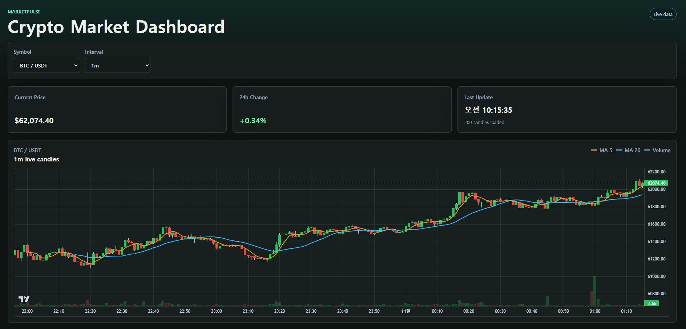
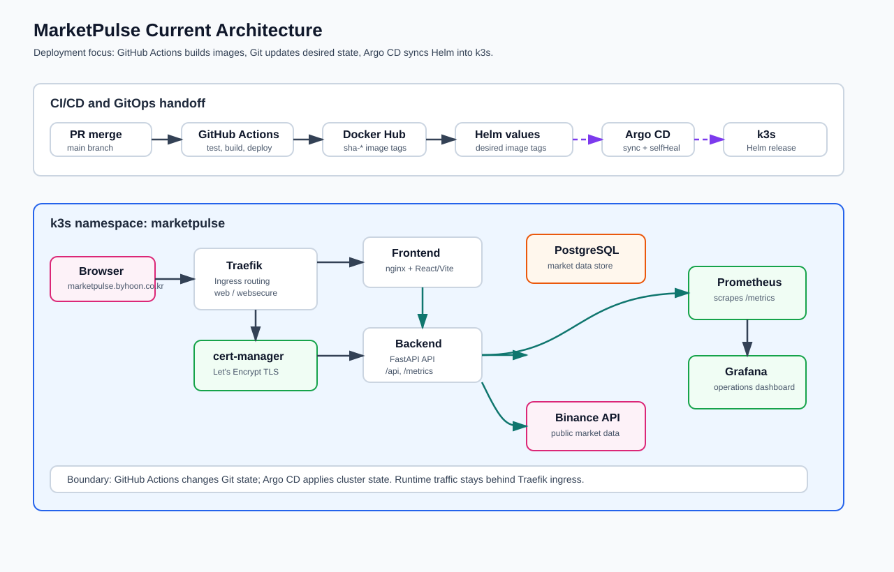

# MarketPulse

MarketPulse는 `BTCUSDT`, `ETHUSDT` 두 종목의 market 데이터를 가져와 차트로 보여주는 대시보드입니다.

React frontend와 FastAPI backend로 구성했고, Docker image를 빌드한 뒤 Helm chart와 Argo CD를 이용해 k3s cluster에 배포했습니다. HTTPS ingress와 Prometheus/Grafana 모니터링도 함께 구성했습니다.

또한 개발 과정에서는 AI를 코드 초안 작성, 반복 수정, 테스트 보강, 문서 정리에 사용했습니다. 단순히 AI가 만든 코드를 그대로 반영하지 않고, task 단위로 범위를 나눈 뒤 diff 확인, lint/test/build 결과 확인, 배포 설정 검토를 거쳐 변경을 관리했습니다.



## 아키텍처



## 아키텍처 흐름

사용자는 `https://marketpulse.byhoon.co.kr`로 dashboard에 접근합니다. 요청은 k3s cluster의 Traefik Ingress로 들어오고, Traefik은 frontend 정적 파일 요청과 backend API 요청을 각각의 Kubernetes Service로 라우팅합니다.

frontend는 React/Vite로 구현되어 있으며 chart 화면을 제공합니다. backend는 FastAPI로 구현되어 Binance public API를 사용해 market 데이터를 조회하고, candle/ticker API를 frontend에 제공합니다. backend의 `/metrics` endpoint는 Prometheus가 수집하고, Grafana dashboard에서 API 상태와 운영 지표를 확인할 수 있습니다.

배포는 GitHub Actions와 Argo CD를 분리해서 구성했습니다. GitHub Actions는 테스트, Docker image build, Docker Hub push, Helm values의 image tag 변경까지만 담당합니다. cluster 반영은 Argo CD가 Git에 기록된 Helm chart 상태를 기준으로 수행합니다.

```text
사용자
  -> Traefik Ingress
  -> Frontend Service
  -> React dashboard
  -> Backend API
  -> Binance public API

GitHub Actions
  -> Docker image build
  -> Docker Hub push
  -> Helm values image tag update
  -> Argo CD sync
  -> k3s deployment

Backend /metrics
  -> Prometheus
  -> Grafana
```

## 주요 구현

### GitOps 기반 배포 흐름

배포는 GitHub Actions와 Argo CD를 이용한 GitOps 방식으로 구성했습니다. Actions workflow가 backend/frontend image를 build하고 Docker Hub에 push한 뒤, Helm values에 `sha-*` image tag를 기록합니다.

Argo CD는 Git repository의 Helm chart 변경을 기준으로 k3s cluster 상태를 동기화합니다. 이 방식은 배포 이력을 Git commit으로 추적할 수 있고, 실제 배포된 image tag와 Git에 기록된 desired state를 맞추기 쉽습니다.

### Helm 기반 k3s runtime

application runtime은 Helm chart로 관리합니다. frontend, backend, PostgreSQL, Ingress, Prometheus, Grafana 구성을 chart 안에서 함께 관리해 로컬 manifest 조각이 아니라 하나의 배포 단위로 운영할 수 있게 했습니다.

HTTPS는 Traefik Ingress와 cert-manager를 사용했습니다. production endpoint는 `marketpulse.byhoon.co.kr`이고, 인증서는 Let's Encrypt 기반으로 발급되도록 구성했습니다.

### 운영 지표와 모니터링

backend는 Prometheus가 수집할 수 있는 `/metrics` endpoint를 제공합니다. Helm chart에는 Prometheus와 Grafana 구성이 포함되어 있어 배포 후 API 요청 수, latency, error 관련 지표를 확인할 수 있습니다.

운영 관점에서는 단순히 app만 띄우는 것이 아니라, 배포 후 상태를 관찰할 수 있는 기본 도구까지 함께 구성하는 것을 목표로 했습니다.

### AI를 활용한 개발 관리

AI는 코드 작성 속도를 높이는 도구로 사용했습니다. 기능을 한 번에 크게 만들기보다 `docs/spec.md`와 `docs/tasks/`에 작업 범위를 먼저 정리하고, backend/frontend/infra 단위로 나누어 구현했습니다.

AI가 만든 변경은 직접 diff를 확인한 뒤 필요한 부분만 반영했습니다. 이후 lint, test, build 결과를 확인하고, 배포 관련 변경은 GitHub Actions, Helm values, Argo CD 흐름이 깨지지 않는지 함께 검토했습니다.

## 기술 스택

- Frontend: React, Vite
- Backend: FastAPI
- Database: PostgreSQL
- Container: Docker
- Deploy: k3s, Helm, Argo CD
- CI/CD: GitHub Actions
- Monitoring: Prometheus, Grafana
